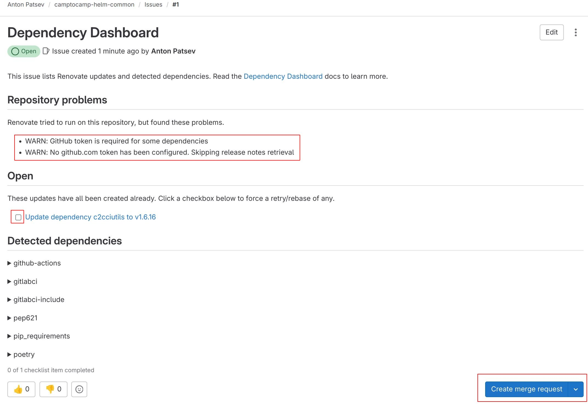
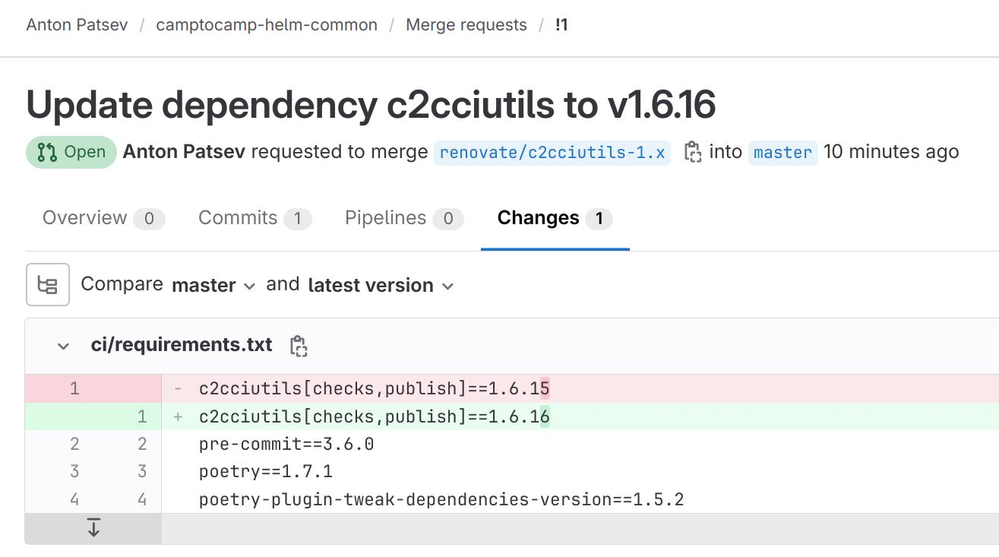
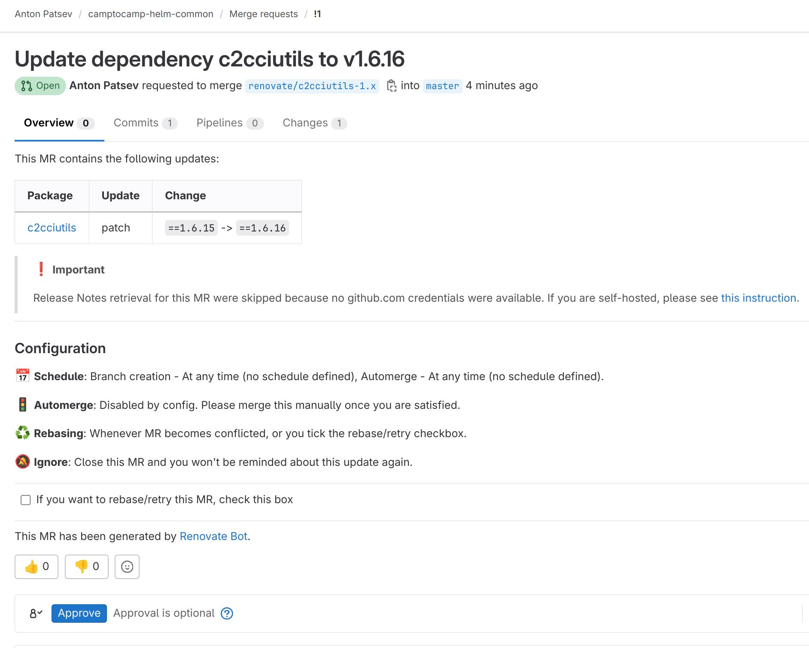
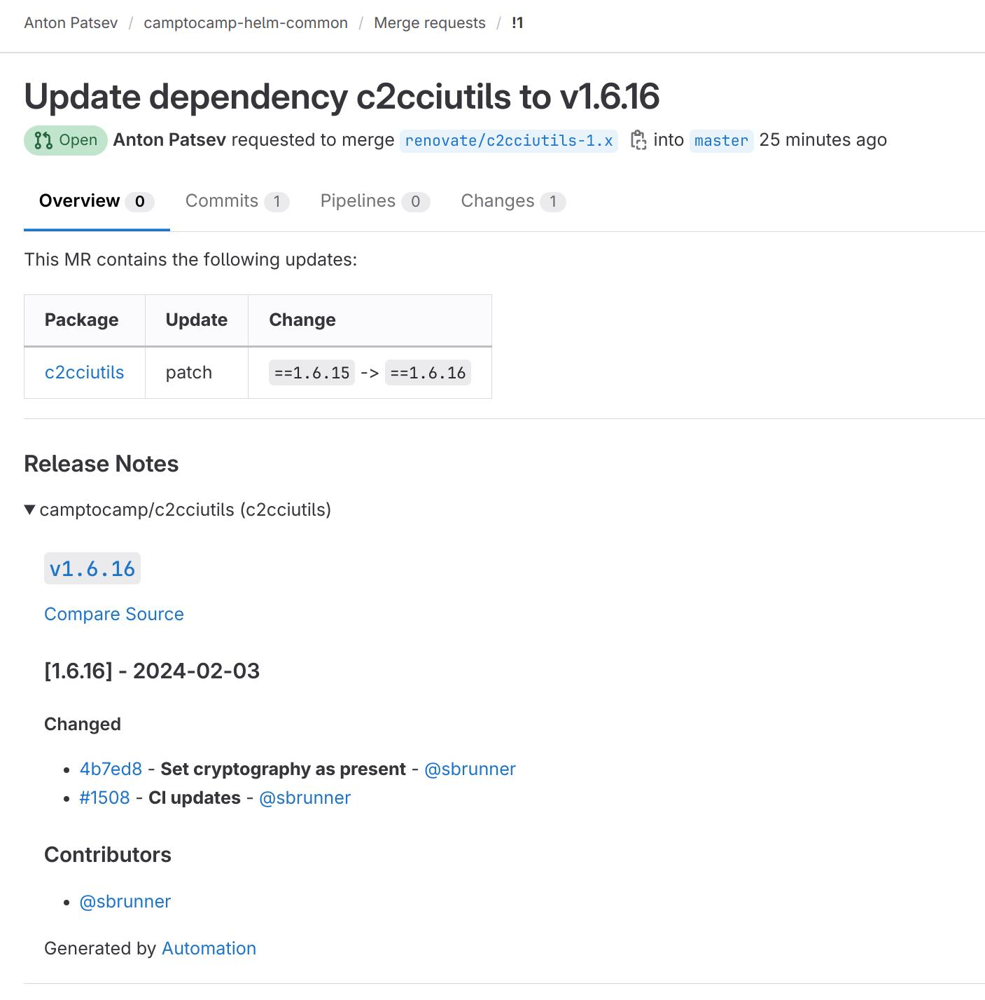

Автоматическое обновление зависимостей в GitLab-проектах с помощью Renovate

# Глава I: Значение автоматического обновления зависимостей в CI/CD процессе

Автоматическое обновление зависимостей становится все более важным аспектом в процессах непрерывной интеграции и непрерывной доставки (CI/CD) в сфере разработки программного обеспечения. Описаны преимущества автоматического обновления зависимостей.

1. Улучшение безопасности:
Один из главных аспектов, которые делают автоматическое обновление зависимостей неотъемлемой частью CI/CD, это улучшение безопасности. Уязвимости и баги в зависимостях могут стать целью для кибератак и угрожать целостности системы. Постоянное отслеживание и обновление зависимостей помогает минимизировать риски, связанные с безопасностью.

2. Улучшение производительности:
Автоматическое обновление зависимостей также способствует улучшению производительности процесса разработки и доставки. Новые версии зависимостей часто включают оптимизации, улучшения производительности и исправления ошибок. Постоянное обновление помогает использовать эти улучшения для более быстрой и эффективной разработки.

3. Лицензия и условия использования:
Renovatebot имеет свободную лицензию [GNU Affero General Public License](https://github.com/renovatebot/renovate/blob/main/license) и его можно использовать для обновления зависимостей как в коммерческих так и в некоммерческих проектах, в отличие от [dependabot](https://github.com/dependabot/dependabot-core?tab=readme-ov-file#license)

4. Упрощение обслуживания:
Ручное обновление зависимостей может быть трудоемким и затратным процессом. Автоматическое обновление снижает нагрузку на разработчиков и позволяет им сосредотачиваться на более важных задачах, таких как создание нового функционала.

5. Сокращение конфликтов и проблем совместимости:
Автоматическое обновление может также снижать возможность конфликтов между зависимостями и проблем совместимости. Это особенно полезно в больших проектах с множеством зависимостей.

6. Поддержка непрерывного улучшения:
Непрерывное обновление зависимостей поддерживает идею непрерывного улучшения кодовой базы. Оно способствует поддержанию актуальности проекта и его соответствию современным стандартам и технологиям.

В заключении, автоматическое обновление зависимостей играет критическую роль в обеспечении безопасности, производительности и качества в CI/CD процессах. Проект Renovate предоставляет инструмент для эффективной реализации этой важной практики в сфере разработки программного обеспечения.

По умолчанию Renovate поддерживает большое количество языков программирования, фреймворков. 
Для большинства разработчиков достаточно базовой настройки. Renovate сам определяет что `*.tf` относится к `terraform`, `pyproject.toml` и `requirements.txt` относится к `python`, `package-lock.json` относится к `Javascript`, `Chart.yaml` и `values.yaml` относится к `helm`, `docker-compose.yml` относится к `docker`.

# Глава II: Подключение renovatebot к GitLab

Renovatebot можно подключить не только к публичным, но и к приватным Gitlab проектам.

Чтобы подключить Renovate (https://github.com/renovatebot/renovate) к GitLab, вам понадобятся следующие шаги:

Создание файла конфигурации в репозитории GitLab:

В корне вашего GitLab-репозитория создайте файл конфигурации для Renovate, который называется `renovate.json`. `renovate.json` - это конфигурационный файл для управления настройками инструмента Renovate, который автоматически обновляет зависимости в вашем проекте. Вот пример минимального файла renovate.json:

```
{
  "extends": ["config:base"]
}
```

Этот файл говорит Renovate использовать базовую конфигурацию для управления обновлениями зависимостей. 

Так как Renovate по умолчанию обновляет minor, patch версии, то ниже показываю конфиг для обновления только patch версий
```
{
  "extends": ["config:base"],
  "packageRules": [
    {
      "matchUpdateTypes": ["patch"]
    }
  ]
}
```

Для настройки GitLab CI/CD с использованием утилиты Renovate вам потребуется определить следующие переменные окружения:

**RENOVATE_TOKEN**: Это токен c scope read_user, api, and write_repository, который предоставляет доступ к вашему репозиторию и позволяет Renovate автоматически обновлять зависимости.

Интеграция Renovate в CI/CD пайплайн:

В файле `.gitlab-ci.yml` вашего проекта добавьте задачу или шаг в пайплайн, который будет запускать Renovate для обновления зависимостей. Этот шаг должен использовать ранее установленный конфигурационный файл Renovate.

Пример `.gitlab-ci.yml` файла с интеграцией Renovate может выглядеть следующим образом:
```
include:
  - project: 'renovate-bot/renovate-runner'
    file: '/templates/renovate.gitlab-ci.yml'

renovate:
  image: ${CI_RENOVATE_IMAGE}
  variables:
    RENOVATE_EXTRA_FLAGS: '$CI_PROJECT_PATH'
  rules:
    - if: '$RENOVATE_TOKEN == null || $RENOVATE_TOKEN == ""'
      when: never
    - if: '$CI_PIPELINE_SOURCE == "schedule"'
```

Для настройки расписания выполнения этой задачи вы можете перейти в раздел `Pipeline schedules` в разделе `Pipeline` и создать расписание с использованием cron-синтаксиса.
По умолчанию renovate не находит репозиторий, поэтому вам нужно указать в переменной `RENOVATE_EXTRA_FLAGS` этот репозиторий (переменная `$CI_PROJECT_PATH`).

Если переменная `$RENOVATE_TOKEN` равна `null` или `пустой строке`, то `pipeline` не запустится.

# Глава III: Просмотр артефактов работы Renovate

Утилита Renovate создает Dashboard и Merge Request (MR) в системе управления версиями (например, в GitHub или GitLab) для обновления зависимостей в вашем проекте. Вот как они обычно выглядят:

Dashboard:



Dashboard в Renovate - это веб-панель управления в issue, которая предоставляет обзор и контроль над процессом обновления зависимостей в ваших проектах.

С его помощью вы можете видеть статус обновлений, настраивать правила обновлений, управлять обновлениями и отслеживать историю изменений.

Mожно выбрать обновление в dashboard его создать MR нажав на кнопку create merge request.

Как видим предупреждение:
 * WARN: GitHub token is required for some dependencies
 * WARN: No github.com token has been configured. Skipping release notes retrieval

Для получения changelog лучше создать Github token и переменную окружения `GITHUB_COM_TOKEN`

Для исправления предупреждения "GitHub token is required for some dependencies" обычно добавляют переменную окружения `GITHUB_COM_TOKEN` и все работает.

Merge Request (Pull Request):

Renovate автоматически создает MR, который включает в себя обновление зависимости до новой версии. Обычно выглядит так:



В MR вы увидите изменения в файлах вашего проекта, связанные с обновлением зависимости. Вы также можете просмотреть изменения, предоставленные Renovate, и протестировать их перед объединением.



# Глава IV: Получение информации о changelog

**GITHUB_COM_TOKEN**: (Опционально) Это токен с scope repo:public_repo нужен для получения информации о changelog в репозиториях.

После добавления `GITHUB_COM_TOKEN` Merge Request будет выглядеть так:



# Глава IV: Расширенные настройки работы Renovate

Дополнительные переменные окружения:

**RENOVATE_BASE_BRANCH**: Эта переменная позволяет вам указать базовую ветку, относительно которой Renovate будет определять, какие зависимости нужно обновлять. Обычно это ваша основная ветка, например, "main" или "master".

**RENOVATE_DISABLE**: Вы можете установить эту переменную в "true", чтобы временно отключить Renovate в вашем проекте, если это необходимо.

По умолчанию Renovate не добавляет метку (labels) к MR, но вы можете добавить, чтобы облегчить классификацию и управление MR используя такой конфиг:
```
{
  "extends": ["config:base"],
  "labels": ["dependencies"],
  "packageRules": [
    {
      "matchUpdateTypes": ["patch"]
    }
  ]
}
```

# Глава V: Настройка типов файлов в renovate.json

Настройка обновлений kubernetes манифестов (yaml)

Если большинство файлов .yaml в вашем репозитории принадлежат Kubernetes, вы можете добавить это в свою конфигурацию:
```
{
  "extends": [
    "config:base"
  ],
  "kubernetes": {
    "fileMatch": ["\\.yaml$"]
  }
}
```


Если вместо этого они все находятся в каталоге k8s/, вы должны добавить это:
```
{
  "extends": [
    "config:base"
  ],
  "kubernetes": {
    "fileMatch": ["k8s/.+\\.yaml$"]
  }
}
```


Настройка обновлений Flux манифестов (yaml)

Если большинство файлов .yaml в вашем репозитории принадлежат Flux, вы можете добавить это в свою конфигурацию:
```
{
  "extends": [
    "config:base"
  ],
  "flux": {
    "fileMatch": ["\\.yaml$"]
  }
}
```


Если вместо этого они все находятся в каталоге k8s/, вы должны добавить это:
```
{
  "extends": [
    "config:base"
  ],
  "flux": {
    "fileMatch": ["flux/.+\\.yaml$"]
  }
}
```

# Глава VI: Обновление уязвимостей

Для проверки версий на уязвимости Renovatebot использует базы:
 * [GitHub Advisory Database](https://github.com/github/advisory-database)
 * [Go Vulnerability Database](https://github.com/golang/vulndb)
 * [PyPI Advisory Database](https://github.com/pypa/advisory-database)
 * [Rust Advisory Database](https://github.com/RustSec/advisory-db)
 * [Vulnerability database for Open Source](https://osv.dev/vulnerability)

Подробнее [здесь](https://github.com/patsevanton/renovate/blob/main/lib/workers/repository/process/vulnerabilities.ts#L553)

Ниже представлен конфиг для обновления только уязвимостей без обычных обновлений.
```
{
  "extends": [ "config:base"],
  "packageRules": [
    {
      "enabled": false,
      "matchPackagePatterns": ["*"]
    }
  ],
  "vulnerabilityAlerts": {
    "enabled": true
  },
  "osvVulnerabilityAlerts": true
}
```

Все конфигурации представлены минимальными для упрощения понимания.
Все конфигурации можно совмещать.
